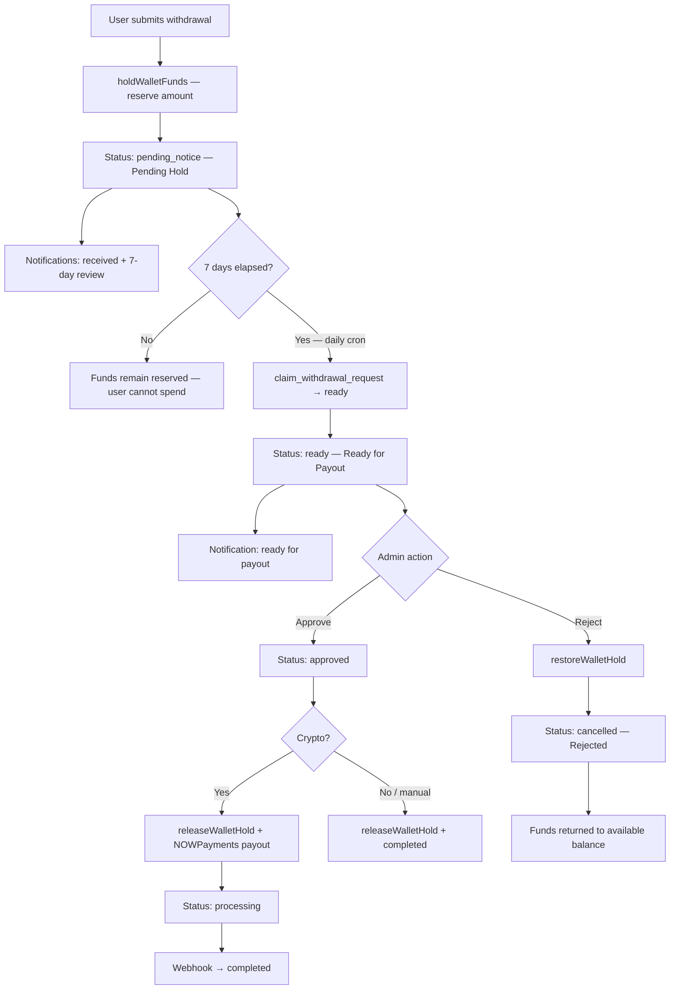

# Withdrawal Hold System Report

**Date:** 2026-07-10  
**Feature:** 7-day withdrawal security hold with fund reservation, automated promotion, and admin-gated payout  
**Status:** Implemented and verified (production build passes)

---

## Executive Summary

PrimeFx Invest wallet withdrawals now enforce a mandatory **7-day holding period** before any payout. On submission, funds are **immediately reserved** (locked) via `atomic_hold_wallet_funds`. A daily cron job promotes due requests from **Pending Hold** → **Ready for Payout**. Admins can **Approve** or **Reject** only after the hold expires. Crypto payouts are initiated only after admin approval — the cron no longer auto-pays crypto withdrawals.

---

## Flow Diagram

### Status Mapping

| User-facing label   | Database status   |
|---------------------|-------------------|
| Pending Hold        | `pending_notice`  |
| Ready for Payout    | `ready`           |
| Approved            | `approved` / `processing` |
| Completed           | `completed`       |
| Rejected            | `cancelled` / `failed` |

---

## Files Modified

| File | Change |
|------|--------|
| `lib/wallet/withdrawal-status.ts` | **NEW** — display labels, hold countdown, admin filter helpers, `canAdminApproveWithdrawal()` |
| `lib/payments/withdrawal-payout.ts` | Cron promotes to `ready` only; admin approve/reject; no auto crypto payout |
| `lib/payments/wallet-ledger.ts` | Block approval during hold; route `ready` → payout executor |
| `lib/wallet/withdrawals.ts` | `fetchUserWithdrawalRequests`, `getWithdrawalRequestById` |
| `lib/notifications/service.ts` | Hold review, ready, approved, rejected notifications |
| `lib/payments/financial-audit.ts` | Added `withdrawal.approved`, `withdrawal.rejected` audit events |
| `lib/data/types.ts` | `WalletWithdrawalRequestItem`; `reservedBalance`, `withdrawableBalance` on `WalletData` |
| `lib/data/queries.ts` | `fetchWalletWithdrawalRequests()`; wallet balance labels |
| `lib/admin/actions.ts` | `approveWithdrawalQueueItem`, `rejectWithdrawalQueueItem` |
| `lib/cron/daily-jobs.ts` | Cron metrics aligned to `readyForPayout` (no auto payout) |
| `components/admin/AdminWithdrawalsView.tsx` | Status filters, approve/reject with hold gating |
| `components/wallet/WithdrawPageView.tsx` | Reserved/withdrawable balances, withdrawal history with hold countdown |

### Unchanged (per constraints)

Authentication, KYC, investments, referrals, deposits, profit engine, unrelated APIs, routing, and translation files were **not modified**.

---

## Database Changes

**None.** The existing schema already supports this flow:

- `withdrawal_requests` — status lifecycle, `requested_at`, `available_at`
- `wallet_balances.pending_balance` — reserved funds
- `claim_withdrawal_request` RPC — atomic `pending_notice` → target status when `available_at <= NOW()`
- `atomic_hold_wallet_funds` / `atomic_restore_wallet_hold` / `atomic_release_wallet_hold` — fund reservation lifecycle

---

## Automation Flow

1. **Daily cron** (`lib/cron/daily-jobs.ts` → `processDueWalletWithdrawals`)
2. Queries `withdrawal_requests` where `status = pending_notice` AND `available_at <= NOW()`
3. For each row, calls `promoteDueWithdrawalToReady()`:
   - Uses `claim_withdrawal_request(id, 'ready')` for idempotent atomic claim
   - Logs `withdrawal.ready` audit event
   - Sends **Ready for payout** notification
4. **Does not** initiate crypto payout or release holds

Admin can also trigger via **Process due financial jobs** in the admin transactions view.

---

## Security Checks

| Risk | Mitigation |
|------|------------|
| Double withdrawal | `atomic_hold_wallet_funds` debits available atomically; insufficient balance rejected |
| Race on promotion | `claim_withdrawal_request` RPC updates only if still `pending_notice` and due |
| Early admin approval | `canAdminApproveWithdrawal()` requires `status = ready` AND `available_at <= now`; UI hides Approve button during hold; `settleApprovedTransaction` throws on `pending_notice` |
| Duplicate approval | Conditional update `status = approved WHERE status = ready` returns null if already claimed |
| Duplicate payout | Crypto path checks existing transaction by `reference_id` before creating payment record |
| Negative balances | All wallet ops use atomic RPCs with balance guards |
| Reject fund loss | `restoreWalletHold` returns reserved → available; conditional cancel prevents double restore |

---

## Notifications

| Event | Notification |
|-------|----------------|
| Submission | Withdrawal request received |
| Submission | 7-day security review (funds reserved) |
| Hold expired (cron) | Ready for payout |
| Admin approve | Withdrawal approved |
| Payout complete | Withdrawal completed (existing webhook path) |
| Admin reject | Withdrawal rejected (funds returned) |

---

## UI Changes

### User — Wallet / Withdraw

- **Available Balance** — spendable funds
- **Reserved Balance** — locked for pending withdrawals (`pending_balance`)
- **Withdrawable Balance** — equals available (hold already deducted)
- **Withdrawal History** — status, requested date, eligible payout date, remaining hold time

### Admin — Withdrawal Queue (`/admin/rewards`)

- Filters: Pending Hold, Ready for Payout, Approved, Completed, Rejected
- **Approve** visible only when hold expired and status is `ready`
- **Reject** for wallet requests in `pending_notice`, `ready`, or `approved`

---

## Validation Results

| Check | Result |
|-------|--------|
| 7-day timer configured | ✅ `WITHDRAWAL_NOTICE_DAYS = 7` in `lib/referral/program-config.ts` |
| Funds reserved on submit | ✅ `holdWalletFunds()` in `createWithdrawalRequest()` |
| Wallet balances correct | ✅ Available ↓, pending/reserved ↑ via atomic RPC |
| User cannot spend reserved | ✅ Available balance reduced at hold time |
| Cron → Ready for Payout | ✅ `promoteDueWithdrawalToReady()` — no auto payout |
| Admin approval gated | ✅ `canAdminApproveWithdrawal()` + UI + ledger guard |
| Reject returns funds | ✅ `rejectWithdrawalRequest()` → `restoreWalletHold()` |
| No duplicate payouts | ✅ Admin-only payout initiation; atomic claim RPC |
| Production build | ✅ `npm run build` exit code 0 |
| TypeScript | ✅ No type errors |
| Zero regression scope | ✅ No changes to auth, KYC, investments, referrals, deposits, profits |

---

## Zero Regression Confirmation

- **Profit engine, deposits, investments, referrals:** untouched
- **Wallet balance mutations:** only via existing hold/release/restore RPCs tied to withdrawal lifecycle
- **Existing withdrawal webhook completion path:** preserved for crypto `processing` → `completed`
- **Capital (investment) withdrawals:** separate flow unchanged; admin queue shows them read-only
- **Production build:** passes after all changes

---

## Operational Notes

1. **Cron frequency:** Runs daily via `/api/cron/daily`. Withdrawals become ready on the first cron run after `available_at`.
2. **Manual admin path:** Transactions admin view still supports approve/reject; withdrawal-type transactions now enforce the hold via `settleApprovedTransaction`.
3. **Crypto provider:** If NOWPayments is unconfigured at approval time, withdrawal stays `approved` with error metadata; no funds released until payout succeeds.

---

## Recommended QA (Live)

1. Submit a test withdrawal → verify available ↓, reserved ↑, status **Pending Hold**
2. Attempt second withdrawal exceeding available → should fail
3. Fast-forward `available_at` in staging OR wait 7 days → run cron → status **Ready for Payout**
4. Confirm Approve hidden before hold, visible after
5. Approve → verify payout initiated (crypto) or completed (manual)
6. Reject a ready request → verify reserved funds returned

---

*Generated as part of the 7-day withdrawal hold implementation.*
